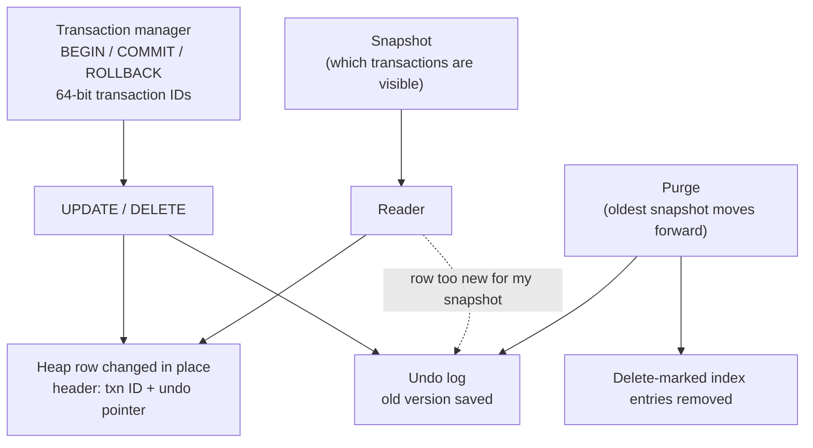

# NoVacDB — Build Progress

This file is the step-by-step build plan. Each step is sized for roughly one focused session. Work happens **one step at a time, in order**.

**Status legend:** ✅ Done · 🚧 In progress · ⬜ Not started · 👉 **CURRENT**

---

## Current step

👉 **Step 6.6 — Row locks and deadlock detection** (next: design doc `18-locking.md`, for review before any code)

---

## Session log

| Date | Step | Result | Notes |
|---|---|---|---|
| 2026-10-03 | 6.0 B+Tree review follow-ups | ✅ Done | Every item was already done by B+Tree design revision 2 (commits `d1f85dd`, `5b5e6d3`): leaf cell `Flags` byte with data format version 2; deferred frees logged (WAL type 6), re-logged by checkpoints and replayed by recovery, with crash tests; the deadlock-freedom argument in `08-btree.md` section 2.9 corrected and `TestConcurrentLeftSiblingRepairs` added; full-page images (problem #8 stays open) and root X-latching in the Limitations. Checked again against the code and docs; nothing left to do. |
| 2026-10-03 | 6.1 Transaction manager | ✅ Done | Design doc `13-transactions.md` (reviewed and approved, including WAL format version 2). 64-bit transaction IDs allocated on the first write and never reused (`NextXID` in checkpoint records, recovered as the maximum of checkpoints and logged IDs); `TxnBegin`/`TxnCommit` records (types 7, 8) replace statement groups; a status table (active, committed, aborted, resolved, unknown) bounded to two checkpoint intervals; `wal.Txn` and executor `Tx` with `Begin`/`Exec`/`ExecPrepared`/`Commit`/`Rollback`, autocommit for everything else, `25P02` after a failure. Interim until undo, versions and locks: one writing transaction at a time holding the exclusive lock, rollback by reopening, size bounded by the pool. Recovery's first pass now refuses unknown record types anywhere (found by a test for the reserved type). Model-checked random transactions with crashes; crash harness with transactions (3000 scenarios: about 11k commits, 2.8k rollbacks, 3.7k open at a crash, all matched); `FuzzTxnRecovery`. 40 deliberate-bug checks: 38 caught (4 after new tests, one of which showed a test passing by accident), 2 found redundant code (removed). |
| 2026-10-03 | 6.2 Undo log | ✅ Done | Design doc `14-undo-log.md` (reviewed and approved, including data format version 3 with undo pages, type 6, and WAL format version 3 with `Undo` and `UndoSegment` records, types 10 and 11). New package `internal/undo`: one segment of undo pages per transaction in the data file; 54-byte record header plus the full previous row image (at most 8090 bytes; Step 6.3 lowers the maximum row to 8000); undo pointers are page × 8192 + offset; `Append` sets the transaction chain itself; every page and record validated on read. Undo pages follow the existing WAL rules (images after a redo point, no steal, deferred frees on release). The segment table is logged on add and drop and logged again by every checkpoint; recovery rebuilds it and follows each segment's pages. Tests: golden bytes, every truncation, `FuzzUndoRecord` and `FuzzDecodeBlocks`, a model test of row chains across 60 transactions, replay byte-for-byte and from a redo point with torn pages, engine crash tests (40 runs with torn writes, in-flight transactions, releases), the table surviving log trimming, released pages freed after a crash. 33 deliberate-bug checks in about 1.5 minutes: 29 caught at first, the other 4 after 3 new test cases and the removal of a duplicate check. |
| 2026-10-04 | 6.3 In-place updates with row versioning | ✅ Done | Design doc `15-row-versioning.md` (reviewed and approved, including data format version 4, a header on every heap row, and WAL format version 4, heap records of up to three blocks). Every row carries the transaction that last wrote it and an undo pointer; `UPDATE` saves the old version to the undo log and changes the row in place; a row that outgrows its page moves and leaves an 18-byte forward stub, so its RID never changes (one hop at most, moving home again when it fits); `DELETE` leaves an 18-byte tombstone; `INSERT` writes an undo record. New package `internal/mvcc` (undo first, then the row, through a `Stamper` callback). Maximum row 8000 bytes. Interim until Step 6.4: undo released at commit. Tests: golden bytes and `FuzzRowHeader`, a heap model test with forwarding invariants (it found that a 12-byte stub could not always become a tombstone), an mvcc model test checking every changed row's undo chain before commit with crashes, 10,000 updates of one row without table or file growth, row size limits, SQL crash workload with rows that move. 30 deliberate-bug checks: 27 caught (4 after new tests), 3 unreachable defensive checks kept. |
| 2026-10-04 | 6.4a Snapshots and visibility (part 1) | ✅ Done | Design doc `16-snapshots-visibility.md` (reviewed and approved, no format change). Snapshots (`XMax`, active transactions) registered by the engine; the visibility rule, following undo chains with every record checked; `READ COMMITTED` and `REPEATABLE READ` (`DB.BeginTx`); a transaction sees its own changes; `REPEATABLE READ` changing a row changed after its snapshot gets `40001`; indexes used only when they describe what the snapshot sees; undo kept while a snapshot needs it, released by the next commit or checkpoint, and by recovery. Readers still wait for a writing transaction (6.4b). Tests: the visibility rule on every case, a model of snapshots held across random commits, undo retention, isolation tests through the executor. 22 deliberate-bug checks: all caught (4 after new tests). |
| 2026-10-04 | 6.4b Snapshots and visibility (part 2): readers beside the writer | ✅ Done | Readers no longer wait for a writing transaction: every statement holds the executor lock shared, a change also takes the writer slot (until its transaction ends), DDL takes the writer slot and the lock exclusively; lock order writer slot, then lock; reopening (rollback, restart, `40001`) trades the shared lock for the exclusive one; `Close` waits for a writing transaction. Two real bugs found by the new tests and fixed: a transaction's ID was not yet active between its allocation and its `TxnBegin` record (a snapshot then saw its uncommitted changes); a committing transaction released its own undo before leaving the active set (a snapshot taken in between found the undo reused). Undo is now released just after the commit record. Index scans are checked as they run (the snapshot must see the last writer, and no new writer may begin during the scan), otherwise the table is read. Tests: a model checker under `-race` (one writer committing and rolling back, `REPEATABLE READ` readers checking every read by heap and by index against the state their snapshot must see, with checkpoints and a small pool), no dirty reads, writers waiting, DDL with concurrent writers, readers during rollbacks and restarts, `Close` waiting, a test hook for a writer beginning before an index scan; the SQL crash harness gained a concurrent reader checking committed states in commit order. 26 deliberate-bug checks: all caught (7 after new tests, 2 equivalent ones replaced). |
| 2026-10-04 | 6.5 Rollback | ✅ Done | Design doc `17-rollback.md` (reviewed and approved, no format change: `TxnAbort`, type 9, was reserved in WAL format 2). A rollback applies the transaction's undo records newest first: each row gets back the exact version (header and data) its change replaced, rows a rollback inserted are removed, and index entries are recomputed from the row's two versions; then `TxnAbort` is logged and made durable. A statement that fails partway with every page consistent (an SQL error, `40001`, a full pool) has exactly its own changes undone back to a savepoint; the transaction is then failed, as in PostgreSQL. Nothing reopens any more, so `REPEATABLE READ` snapshots survive other sessions' rollbacks; only transactions that changed the schema still roll back by reopening. Recovery replays rolled-back transactions (changes and reversal), since later records depend on their page layout. `applyChanges` now handles each row's heap write and index changes together, so no index entry changes before its row's undo record exists. Tests: an acceptance model test (random transactions, rows that move, statements failed at every point by a test hook: every row version and index entry identical to before, byte for byte), statement rollback, write conflicts, failures during a rollback with crashes, replay of rolled-back transactions, undo kept while a snapshot needs it, the concurrent model checker with no `40001` left. 28 deliberate-bug checks: all caught (3 after new tests). |

---

## Completed phases

| Phase | Name | Status |
|---|---|---|
| 0 | Bootstrap: project skeleton, virtual file system | ✅ |
| 1 | Storage: page format, disk manager, buffer pool, heap tables | ✅ |
| 2 | Write-ahead log, checkpoints, crash recovery | ✅ |
| 3 | B+Tree indexes | ✅ |
| 4 | SQL: lexer, parser, types, catalog, executor, SQL logic tests | ✅ |
| 5 | PostgreSQL wire protocol | ✅ |
| 🎯 | **MVP: `psql` connects; create, insert, query, update, delete; data survives crashes** | ✅ |

---

## Phase 6 — Transactions and MVCC (no VACUUM)

### Goal

Multi-statement transactions with snapshot isolation, built on **in-place updates and an undo log**, so that:

- tables never fill up with dead row versions (no bloat),
- no VACUUM is ever needed,
- transaction IDs never wrap around,
- old row versions are cleaned up automatically once no reader needs them.

### How it fits together

### Rules for this phase

- **Design review is required for every step.** No step in this phase runs without the maintainer reading and approving its design doc first.
- **Approved on-disk format change:** Step 6.3 changes the heap row header. There is no production data yet, so no migration is needed, but the data format version must be bumped and old files must be rejected with a clear error.
- Every step keeps crash safety: every new on-disk structure is WAL-logged and covered by crash tests.

---

### ✅ Step 6.0 — B+Tree review follow-ups

**Goal:** Close the gaps found in the B+Tree design review before MVCC builds on top of it. *(If any item below is already done, mark it and move on.)*

**Scope:**
- Reserve a `u8 Flags` byte in the B+Tree leaf cell format (zero for now), so Step 6.7 can delete-mark index entries without another format change. Bump the format version.
- Make the deferred-free page list survive crashes (persist it with the checkpoint or log it).
- Correct the deadlock-freedom argument in `08-btree.md` section 2.9 (delete repair can latch a left sibling after the node itself), and add a concurrency test targeting left-sibling repairs.
- Add to `08-btree.md` Limitations: full-page images in the WAL (problem #8 stays unfixed) and every writer X-latching the root.

**Acceptance:** Design doc updated; all B+Tree tests, fuzz, and crash tests pass with the new cell format; a crash test proves deferred frees are no longer lost.

**Done:** all four items were already delivered by B+Tree design revision 2 (`d1f85dd`, `5b5e6d3`); see the session log.

---

### ✅ Step 6.1 — Transaction manager

**Goal:** Group many statements into one all-or-nothing unit.

**Scope:**
- 64-bit transaction IDs, allocated monotonically, never reused; the next ID survives restarts.
- Transaction states: active, committed, aborted. A transaction status table that answers "did transaction X commit?"
- `BEGIN`, `COMMIT`, `ROLLBACK` at the engine level; every statement outside `BEGIN` runs in its own autocommit transaction.
- Commit record in the WAL; `COMMIT` returns only after it is fsynced.
- Design doc `13-transactions.md`.

**Out of scope:** undo, visibility, locking (later steps).

**Acceptance:** IDs strictly increase across restarts and crashes; committed status survives crashes; a transaction without a durable commit record is treated as aborted after recovery.

---

### ✅ Step 6.2 — Undo log

**Goal:** A separate, self-contained home for old row versions.

**Scope:**
- Undo pages and undo segments, allocated per transaction.
- Undo record format: transaction ID, operation type (insert, update, delete), target row ID, the previous row image (or only the changed columns), and a pointer to the previous undo record for the same row.
- Every undo write is WAL-logged.
- Design doc `14-undo-log.md` with byte layouts.

**Acceptance:** Undo records round-trip; a fuzz target for undo record decoding; undo pages survive crashes; model-based tests for undo chains.

---

### ✅ Step 6.3 — In-place updates with row versioning

**Goal:** The core difference from PostgreSQL: rows change where they are.

**Scope:**
- New heap row header: creating/last-modifying transaction ID, undo pointer, flags (deleted).
- `UPDATE` writes the old version to the undo log, then changes the row in place. If the new row no longer fits on its page, move it and leave a forwarding pointer (design doc must explain the trade-offs).
- `DELETE` marks the row deleted and records undo; the space is reclaimed later by purge.
- `INSERT` records an undo entry so it can be rolled back.
- Design doc `15-row-versioning.md`.

**Acceptance:** Repeated updates of the same row do not grow the table; model-based tests with random insert/update/delete; crash tests pass.

---

### ✅ Step 6.4 — Snapshots and visibility

**Goal:** Every reader sees a consistent picture of the data.

**Scope:**
- Snapshot (read view): the oldest active, newest allocated, and list of in-progress transaction IDs at the moment it is taken.
- Visibility rule: if the row's version is not visible to the snapshot, walk its undo chain back to the newest visible version.
- Isolation levels: `READ COMMITTED` (new snapshot per statement, PostgreSQL's default) and `REPEATABLE READ` (one snapshot per transaction).
- A transaction always sees its own changes.
- Design doc `16-snapshots-visibility.md`.

**Acceptance:** Tests for the classic anomalies: no dirty reads; non-repeatable reads prevented under `REPEATABLE READ`; phantom behaviour documented. Concurrent readers and writers under `-race` with a model checker.

---

### ✅ Step 6.5 — Rollback

**Goal:** `ROLLBACK` and failed statements undo their changes exactly.

**Scope:**
- Apply a transaction's undo records in reverse order.
- Statement-level rollback: an error inside a transaction undoes that statement only (the transaction then enters the aborted state, as in PostgreSQL).
- Rollback steps are WAL-logged (compensation records) so a crash during rollback is safe.
- Design doc `17-rollback.md`.

**Acceptance:** Random transactions rolled back leave data byte-identical to before; crash during rollback recovers correctly.

---

### 👉 Step 6.6 — Row locks and deadlock detection

**Goal:** Two transactions changing the same row behave correctly.

**Scope:**
- Row-level write locks (stored on the row or in a lock table; design doc decides).
- Write-write conflicts: under `READ COMMITTED` the second writer waits, then re-checks the latest version; under `REPEATABLE READ` it fails with a serialization error (SQLSTATE `40001`), as in PostgreSQL.
- `SELECT ... FOR UPDATE`.
- Lock manager with a wait-for graph and deadlock detection. The error reports exactly which transactions and rows formed the cycle (problem #43).
- Lock wait timeout setting.
- Design doc `18-locking.md`.

**Acceptance:** Concurrency tests for lost updates, waits, timeouts, and deadlocks; deadlock reports are readable and accurate.

---

### ⬜ Step 6.7 — Indexes under MVCC

**Goal:** Index lookups return the correct version for each snapshot.

**Scope:**
- When an indexed column changes, keep the old index entry (delete-marked using the leaf cell `Flags` byte from Step 6.0) and add the new one.
- Index scans re-check the visible row version against the search key.
- Unique constraints check against all versions that might still commit, not just visible ones.
- NULLs in unique indexes behave as in PostgreSQL (multiple NULLs allowed).
- Design doc update for `08-btree.md` plus `19-mvcc-indexes.md`.

**Acceptance:** Model-based tests with concurrent snapshots and indexed updates; unique violations raised exactly when PostgreSQL would raise them.

---

### ⬜ Step 6.8 — Purge: automatic cleanup (no VACUUM)

**Goal:** Old versions disappear on their own once nobody can see them.

**Scope:**
- Track the oldest active snapshot. Undo records older than it are no longer needed.
- Background purge: discard old undo, remove delete-marked index entries, reclaim space from deleted rows.
- Purge only touches undo and the specific rows/entries it names. It **never scans whole tables**.
- Bounded and observable undo retention: report undo size and the oldest transaction holding it back; a configurable limit and warning for long-running transactions (problem #24).
- Design doc `20-purge.md`.

**Acceptance:** Under a long random workload with concurrent snapshots, undo size stays bounded, table and index sizes stay flat for update-heavy loads, and no visible version is ever purged too early (model checker).

---

### ⬜ Step 6.9 — Crash recovery with transactions

**Goal:** After a crash, committed transactions are complete and uncommitted ones are gone.

**Scope:**
- Recovery runs redo (existing), then **undo** of every transaction without a commit record, using the undo log and writing compensation records.
- Crash during recovery is safe (recovery is restartable).
- Crash test harness gains multi-statement transactions, rollbacks, and concurrent sessions.
- Design doc update for `07-checkpoints-recovery.md`.

**Acceptance:** Thousands of seeded crash runs: every committed transaction fully present, every uncommitted one fully absent, no partial transactions ever visible.

---

### ⬜ Step 6.10 — Transactions over the wire

**Goal:** Real clients can use transactions.

**Scope:**
- `BEGIN`, `START TRANSACTION`, `COMMIT`, `END`, `ROLLBACK`, `SET TRANSACTION ISOLATION LEVEL`, `SAVEPOINT` (or a clear "not supported" error if deferred).
- `ReadyForQuery` reports the correct transaction status (`I` idle, `T` in transaction, `E` failed transaction).
- After an error inside a transaction, every statement fails until `ROLLBACK`, exactly as in PostgreSQL.
- Closing a connection mid-transaction rolls it back.
- SQL logic tests and end-to-end protocol tests for all of the above.

**Acceptance:** `psql` sessions behave the same as against PostgreSQL for the supported commands; Node.js `pg` driver transaction tests pass.

---

### ⬜ Step 6.11 — Proof and benchmarks

**Goal:** Prove the claims with numbers before marking anything fixed.

**Scope:**
- **Bloat benchmark:** update the same rows millions of times; record table and index size over time for NoVacDB and PostgreSQL.
- **Wraparound:** show transaction IDs are 64-bit end to end; test behaviour near artificially high IDs.
- **Write amplification:** bytes written per `UPDATE`, with and without indexed column changes, compared with PostgreSQL.
- **Long transactions:** show undo growth while a long transaction is open and cleanup once it ends.
- `pgbench` comparison for a mixed workload.
- Publish results in `bench/` with hardware, settings, and graphs.
- Update `WORKFLOW.md` Section 4: mark problems #1–#6, #24, and #43 ✅ **only** where a benchmark or test proves it, and update the progress summary.

**Acceptance:** Results reproducible from scripts in `bench/`; every ✅ in the checklist links to its proof.

---

## Windows support (after Phase 6, before Phase 7)

Decided on 2026-10-04: the server is made Windows-native only once Phase 6 is complete, because Phase 6 still changes storage and crash recovery. Until then, run the server on Linux or WSL; Windows clients (NoVacDB Studio, `psql`, pgAdmin) connect to it over `localhost`.

**Today:** the code compiles for Windows (`GOOS=windows go build ./...`), but the file layer (`internal/vfs/osfs.go`) assumes POSIX behaviour, so the server is not expected to run correctly there yet:
- `SyncDir` fsyncs a directory handle, which Windows does not allow that way;
- files are renamed or removed while open, which Windows refuses;
- the durability guarantees (what reaches disk after `Sync`) have only been tested on Linux.

### ⬜ Step W.1 — Windows-native server

**Goal:** `novacdb.exe` runs on Windows with the same crash-safety guarantees as on Linux.

**Scope:**
- Windows implementation of the file layer (`vfs`): durable directory changes, rename and remove of files that may be open, file locking so two servers cannot open one data directory.
- Default paths and signals (Ctrl+C, service stop) that make sense on Windows.
- The whole test suite, the crash tests and a real kill test run on Windows (CI job on a Windows runner).
- A release build of `novacdb.exe`, and README instructions for Windows (PowerShell and `cmd` commands).
- Design doc for the file-layer changes, reviewed before any code.

**Acceptance:** `make check` (or its Windows equivalent) passes on Windows; crash and kill tests pass there; a fresh Windows machine can download `novacdb.exe`, start it, and connect with `psql`, pgAdmin and NoVacDB Studio.

---

## Security (after Phase 6, with or right after Windows support)

Decided on 2026-10-04: security at least as complete as PostgreSQL's, and better where PostgreSQL is weak. Every connection must authenticate with a password. Today authentication is "trust" (anyone who can reach the port is in, `12-wire-protocol.md` section 2), which is why the server listens on `localhost` only. These steps replace that before NoVacDB is offered for use beyond one's own machine. Each step has its own design doc, reviewed before any code, and uses only the Go standard library (`crypto/...`).

**Where NoVacDB aims to be better than PostgreSQL:**

| | PostgreSQL | NoVacDB |
|---|---|---|
| Default authentication | Often `trust` in local installs; `md5` still accepted | Password (SCRAM) by default everywhere; no `md5` at all; trust only with an explicit flag, on `localhost` |
| Brute-force protection | Needs the `auth_delay` extension | Built in (S.1) |
| Passwords in logs | `CREATE ROLE ... PASSWORD '...'` can reach the server log | Never logged, anywhere (S.1) |
| Encryption of data on disk | Not in community PostgreSQL | Built in: data file and WAL (S.5) |
| Audit log | Needs the `pgaudit` extension | Built in (S.6) |

### ⬜ Step S.1 — Users and password authentication

**Goal:** no connection without a valid user and password.

**Scope:**
- **SCRAM-SHA-256**, as in PostgreSQL: the password never crosses the network, and the server stores only a salted, iterated hash. No `md5` or plain-text password methods. `psql`, pgAdmin, drivers and NoVacDB Studio work unchanged.
- **Users in the catalog:** `CREATE USER name PASSWORD '...'`, `ALTER USER ... PASSWORD`, `DROP USER`, `VALID UNTIL` (password expiry), per-user `CONNECTION LIMIT`.
- **Passwords never appear in logs, error messages or statement history**: statements that carry a password are redacted before anything records them.
- **First start:** the server refuses to start without an initial superuser and password (given once, e.g. `novacdb init --user ...`, with the password read from the terminal or a file, never from the command line).
- **Password is the default everywhere.** Running without passwords ("trust") needs an explicit flag, is allowed only on `localhost`, and logs a warning at every start.
- **Failed logins:** the same error whether the user exists or not (no user enumeration); a growing delay after repeated failures from one address or for one user; every failure logged with its address.
- **Access rules by address** (like `pg_hba.conf`): which users may connect from which addresses, and how.

**Acceptance:** wrong password, unknown user, expired password and a missing password are all refused with PostgreSQL's error code (`28P01`) and the same message; the stored hash verifies against PostgreSQL's own SCRAM test vectors; a test greps every log for test passwords and finds none; a fuzzed authentication exchange never crashes the server.

---

### ⬜ Step S.2 — Encrypted connections (TLS) and certificate login

**Goal:** nobody on the network can read or change what a client and the server exchange.

**Scope:**
- TLS on the PostgreSQL protocol (the `SSLRequest` that is declined today), with a certificate and key given to the server; `sslmode=require` and `verify-full` work from `psql`.
- **Client certificate authentication** (as PostgreSQL's `cert` method), optionally together with a password.
- A setting to refuse connections without TLS from addresses other than `localhost` (the default once a certificate is configured).
- Only TLS 1.2 and newer, with modern cipher suites; the key file must not be readable by other users, or the server refuses to start.

**Acceptance:** connections from `psql`, pgAdmin and Studio with `sslmode=verify-full`, and with a client certificate; a client asking for no TLS is refused when TLS is required; the handshake is fuzzed.

---

### ⬜ Step S.3 — Privileges

**Goal:** a user can only do what they were allowed to do.

**Scope:**
- Superuser, and ordinary users who own the objects they create; roles that group users.
- `GRANT` / `REVOKE` of `SELECT`, `INSERT`, `UPDATE`, `DELETE` on tables and **on single columns**, and of the right to create tables; default privileges for new tables. Checked on every statement (`42501` insufficient privilege, as PostgreSQL).
- Only a superuser manages users; the superuser can be kept off the network (local connections only).

**Acceptance:** a model test of random grants, revokes and statements: every statement is allowed exactly when the model says so.

---

### ⬜ Step S.4 — Row-level security

**Goal:** users see and change only the rows a policy allows (for example, each customer only their own orders).

**Scope:**
- `ALTER TABLE ... ENABLE ROW LEVEL SECURITY`, and `CREATE POLICY` with `USING` (which rows are visible) and `WITH CHECK` (which rows may be written), as in PostgreSQL.
- Policies apply to every access path: scans, index lookups, `UPDATE` and `DELETE`, and are not bypassed by the planner (Phase 7).

**Acceptance:** a model test with random policies and users: no statement reads or writes a row its policy forbids, by any access path.

---

### ⬜ Step S.5 — Encryption at rest (better than PostgreSQL)

**Goal:** someone who copies the data directory or a backup cannot read the data.

**Scope:**
- Every page of the data file and every WAL record encrypted with AES-256-GCM, which also detects tampering.
- A key hierarchy: a master key outside the data directory (a file or an environment variable, later a key management service) that encrypts the data keys; changing the master key without rewriting the data.
- A data format change, which its design doc must justify and the maintainer approve.

**Acceptance:** no plaintext row value appears anywhere in the data directory (test greps the files for known values); a changed byte on disk is reported as corruption, never returned; crash tests pass with encryption on; the cost is measured (Step 6.11 style benchmark).

---

### ⬜ Step S.6 — Audit log (better than PostgreSQL)

**Goal:** a record of who did what, without an extension.

**Scope:**
- Logins (success and failure, with address), user and privilege changes, schema changes, and optionally data changes per table.
- Written to its own append-only file, each entry chained to the previous one by a hash so that deleting or editing an entry is detectable.
- Passwords and, if configured, data values never written to it.

**Acceptance:** every event type appears exactly once per action; a changed or removed entry is detected; the audit log survives crashes like the WAL.

---

### ⬜ Step S.7 — Security review and hardening

**Goal:** close what the earlier steps did not.

**Scope:**
- Limits that stop one client from taking the server down: connections per user and per address, maximum message and query size, statement and idle timeouts, memory per query.
- File permissions: the data directory and its files readable only by the server's user; refuse to start otherwise.
- A written threat model (`docs/SECURITY.md`): what NoVacDB protects against, what it does not, and how to report a vulnerability.
- A full review of the protocol, authentication and privilege code, and long fuzzing runs of every message the server reads.

**Acceptance:** the threat model's every claim has a test; fuzzing finds no crash; `SECURITY.md` published.

---

## Later phases (detailed when we get there)

- **Phase 7 — Planner:** joins, aggregates, `GROUP BY`, statistics, cost-based plan choice, plan hints
- **Phase 8 — Query insights and benchmarks:** slow-query capture, metrics endpoint, `pgbench` comparisons with PostgreSQL
- **Phase 9 — Compatibility:** `pg_catalog` and `information_schema` so `\dt`, GUI tools, Prisma, TypeORM, and Drizzle work
- **Phase 10 — Operations:** online schema changes, online index builds, backups and point-in-time restore
- **Phase 11 — Data features:** change streams, audit log, temporal tables, data deletion for privacy laws
