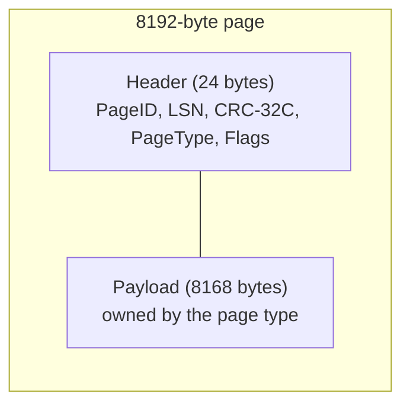

# 02 — Page Format (`internal/storage`)

Status: **Approved and implemented (Step 1.1)**

## 1. Problem

NoVacDB stores everything (table rows, B+Tree nodes, metadata) in fixed-size **pages**. Before any of those exist we need one shared definition of what a page is on disk:

- a fixed size, so page N lives at byte offset `N * 8192` and can be read or written alone;
- a small **header** that says which page this is, which WAL record last changed it (LSN), and what kind of page it is;
- a **checksum**, so a torn write, bit rot or a write to the wrong place is detected instead of silently used.

This step builds only the format and its encode, decode, seal and verify functions. It does no file I/O (that is Step 1.2) and has no knowledge of page contents beyond the header.

## 2. Design

A page is exactly `PageSize = 8192` bytes: a 24-byte header followed by an 8168-byte payload that the owning component (heap, B+Tree, ...) lays out as it likes.



Public API (package `storage`; pure functions over `[]byte`, no state):

```go
const (
    PageSize    = 8192
    HeaderSize  = 24
    PayloadSize = PageSize - HeaderSize
)

type PageType uint16
const (
    PageTypeInvalid       PageType = 0 // never a valid type; an all-zero page decodes to this
    PageTypeFileHeader    PageType = 1 // Step 1.2
    PageTypeFree          PageType = 2 // Step 1.2
    PageTypeHeap          PageType = 3 // Step 1.4
    PageTypeBTreeInternal PageType = 4 // Step 3.1
    PageTypeBTreeLeaf     PageType = 5 // Step 3.1
    PageTypeUndo          PageType = 6 // Step 6.2 (14-undo-log.md)
)

type Header struct {
    ID    uint64
    LSN   uint64
    Type  PageType
    Flags uint16
}

func InitPage(buf []byte, h Header) error  // zero the page, write the header (CRC not yet set)
func DecodeHeader(buf []byte) (Header, error) // structure checks only, no CRC check
func Seal(buf []byte) error                 // compute CRC-32C and store it; call just before writing to disk
func Verify(buf []byte, wantID uint64) error // full check after reading from disk
func Payload(buf []byte) []byte             // buf[HeaderSize:], with length check
```

Rules:

- **Checksum scope.** CRC-32C (Castagnoli table from `hash/crc32`) over the entire 8192 bytes with the 4 CRC bytes treated as zero. It is computed by feeding `buf[0:16]`, four zero bytes, then `buf[20:8192]` into `crc32.Update`, so no copy of the page is needed. Covering the header means a corrupted LSN or page ID is caught too.
- **When the CRC is set.** Only `Seal` writes it, right before the page is handed to the disk manager. In-memory pages in the buffer pool have a stale CRC and nobody reads it until the page is read back from disk.
- **`Verify` checks, in order:** buffer length is exactly `PageSize` (`ErrBadSize`); the page is not entirely zero (`ErrZeroPage`, see below); CRC matches (`ErrChecksum`); type is a known non-zero type (`ErrBadPageType`); header page ID equals `wantID` (`ErrPageIDMismatch`). The ID check catches a page written to the wrong offset, which a CRC alone cannot.
- **All-zero pages.** Extending a file produces zero bytes, and the CRC-32C of zeros is not zero, so an all-zero page would look corrupt. `Verify` returns the distinct `ErrZeroPage` so the disk manager can treat "never written" differently from "damaged".
- **Flags** are opaque to this package: it stores and returns them. Page types define their own bits.
- **Unknown page types** are rejected by `DecodeHeader` and `Verify`. Adding a type means adding a constant here, which is a deliberate, reviewed change to the format.
- **Errors** wrap sentinels with `%w` and include the page ID where known. No function panics on any input.

## 3. Formats

All integers are little-endian (`encoding/binary`).

Page layout (8192 bytes):

| offset | size | field |
|---|---|---|
| 0 | 24 | header |
| 24 | 8168 | payload |

Page header layout (24 bytes):

| offset | size | field | notes |
|---|---|---|---|
| 0 | 8 | PageID | uint64; page N is at file offset N × 8192 |
| 8 | 8 | LSN | uint64; WAL position of the last change to this page (0 = none yet) |
| 16 | 4 | CRC-32C | uint32; computed over the whole page with this field zeroed |
| 20 | 2 | PageType | uint16; see constants above |
| 22 | 2 | Flags | uint16; meaning defined by each page type |

The payload starts at offset 24, which is 8-byte aligned. This layout is also the comment above the encode/decode code.

## 4. Concurrency

The package holds no state: every function reads or writes only the buffer it is given. A buffer must not be modified while `Seal` or `Verify` runs on it; protecting a page against concurrent access is the buffer pool's job (Step 1.3), not this package's.

## 5. Failure and crash behaviour

- A torn page (only part of the 8 KiB reached disk) fails `Verify` with `ErrChecksum`, unless every torn byte happens to match, which has probability about 2⁻³².
- A page written to the wrong offset fails with `ErrPageIDMismatch`.
- Bit rot fails with `ErrChecksum`.
- Detection only: this package cannot repair a bad page. Repair from the WAL arrives with recovery (Phase 2); until then a failed `Verify` is a hard error to the caller.
- Buffers of the wrong length return `ErrBadSize` instead of panicking.

## 6. Alternatives considered

- **Page size 4 KiB or 16 KiB.** 4 KiB matches the OS page but wastes header overhead on large rows and makes B+Tree nodes shallow-fan-out; 16 KiB raises write amplification. 8 KiB matches PostgreSQL, which keeps comparisons fair. It is locked by the project rules.
- **Checksum in a trailer at the end of the page.** Equivalent protection, but a header keeps everything about a page in one place and lets us read the header alone when only the type or ID is needed.
- **CRC-64 / xxHash / SHA-256.** Not in the standard library (xxHash) or needlessly slow (SHA-256). CRC-32C is locked by the project rules and has hardware support on amd64 and arm64.
- **4-byte page IDs.** Saves 4 bytes per page but limits a file to 32 TiB and complicates a later widening. IDs are locked as uint64.
- **Skipping the CRC for in-memory pages by keeping it always current.** Would cost a CRC on every change; sealing only at write time is cheaper and equally safe.
- **Zeroed pages treated as valid.** Rejected: it would hide a lost write that left zeros.

## 7. Testing plan

- Table-driven round trips: `InitPage` then `DecodeHeader` returns the same header for each page type, extreme values (ID and LSN 0 and `math.MaxUint64`, Flags 0 and 0xFFFF).
- Byte-layout test: encode a known header and compare against hand-written expected bytes, pinning offsets and endianness.
- `Seal` then `Verify` passes. Flip each single byte of a sealed page in a loop over all 8192 positions: `Verify` fails for every one (CRC field, header and payload alike). Flip each single bit in the header and a sample of payload positions.
- Wrong-length buffers (nil, 0, 8191, 8193, 16384) return `ErrBadSize` from every function.
- All-zero page returns `ErrZeroPage`; page with a valid CRC but type 0 or an unknown type returns `ErrBadPageType`; sealed page verified with another ID returns `ErrPageIDMismatch`.
- Stability test: the CRC of a fixed page is a hard-coded constant, so an accidental change to scope or polynomial fails a test.
- `Seal` is idempotent and does not touch bytes outside the CRC field.
- **Fuzz targets** with seed corpus: `FuzzDecodeHeader` and `FuzzVerify` accept arbitrary bytes, must never panic, and any page that passes `Verify` must round-trip through `DecodeHeader`. Run 30 s each in `make check`.
- Seeded randomness (`math/rand/v2`, `NOVACDB_SEED`) for random-page and random-corruption tests.
- Coverage target at least 80%; no file I/O so no crash tests in this step.

## 8. Limitations

- No format version inside a page; the file header page (Step 1.2) carries the format version for the whole file.
- No compression, encryption or per-page repair.
- Payload layouts for heap and B+Tree pages are not defined here.
- Little-endian only; no big-endian read support.
- A 32-bit CRC has a 2⁻³² chance of missing a random corruption.
