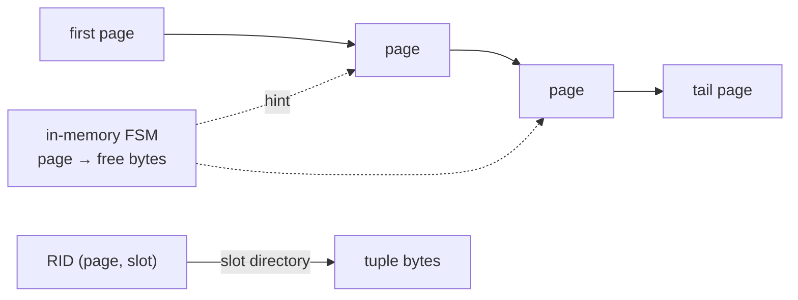

# 05 — Slotted Pages and Heap Tables (`internal/storage`)

Status: **Implemented (Step 1.4); written and approved under the standing autonomous-mode instruction.** Since Step 6.3, every heap tuple carries a row header, and rows keep their RID when they move (forward stubs), are deleted as tombstones and are at most 8000 bytes: see 15-row-versioning.md. The slotted-page layer below is unchanged.

## 1. Problem

Rows have different lengths and change over time. Two layers turn fixed 8 KiB pages into a table:

1. **Slotted page.** Stores variable-length tuples inside one page. A *slot directory* at the front maps a slot number to the tuple's position, so a tuple can move inside the page (compaction) without its slot number changing.
2. **Heap file.** A table is a chain of slotted pages. A **record ID** `(page ID, slot)` names one row. The heap finds a page with room for an insert (free-space map), and a full scan visits every row.

The heap works only in bytes: it knows nothing about columns or SQL types (Phase 4), transactions (Phase 6) or the WAL (Phase 2).

## 2. Design

### Slotted page

```
 0                  24        40                                   upper            8192
 +------------------+---------+----+----+----+---------------------+----------------+
 | page header (24) | heap hdr| s0 | s1 | .. |   free space        | tuples (grow ↓)|
 +------------------+---------+----+----+----+---------------------+----------------+
                                  slot directory grows →      ← tuple data grows
```

- The slot directory grows up from offset 40, four bytes per slot. Tuple data grows down from the end of the page. Free space is the gap between them.
- A slot is **live** (offset, length ≥ 1) or **dead** (offset 0, length 0). Offset 0 can never hold a tuple, because the page header is there.
- **Insert** reuses the lowest-numbered dead slot, else appends a slot. Needs `len` bytes (plus 4 if a new slot entry is needed). If the contiguous gap is too small but total free space is enough, the page is **compacted** first.
- **Delete** marks the slot dead and zeroes the tuple bytes (no stale data is left behind). Trailing dead slots are trimmed from the directory, and a page with no live tuples is reset to empty.
- **Update** keeps the slot number. Same or smaller size: overwrite in place (the tail is zeroed). Larger: relocate within the page (compacting if needed). If the page cannot hold it even after compaction, `ErrNoSpace` is returned **and the page is unchanged**.
- **Compaction** slides live tuples to the end of the page in place (processing from the highest address down, so no tuple is overwritten before it moves), leaving slot numbers unchanged, and zeroes the freed gap.
- Every mutating call either fully succeeds or leaves the page byte-for-byte unchanged.
- Tuples are 1 to `MaxTupleSize` (8148) bytes. Empty tuples are rejected (`ErrEmptyTuple`) so "live" always means length ≥ 1; larger values need overflow pages, a later feature.
- `Get` returns a slice that **aliases the page**; it is valid only while the page stays pinned and latched. The heap layer copies.
- `Validate` fully checks a page's structure. `NewSlottedPage` does only the cheap O(1) checks; every access also bounds-checks, so a corrupt page makes calls return `ErrCorruptPage` and never panics or reads outside the page.

### Heap file

- A heap is identified by the page ID of its **first page**. That ID never changes; the catalog (Step 4.4) will store it.
- Pages form a **singly linked chain** through the `NextPage` field in each page's heap header (0 = end). The chain is the only persistent structure.
- **Free-space map (FSM):** in memory, one entry per page: the largest tuple that page could take now. It is a *hint*: the page itself is always the authority. It is rebuilt by `OpenHeap`, which walks the chain, validates each page, and detects cycles and non-heap pages.
- **Insert:** pick the first page (cyclically, starting after the last hit) whose FSM entry is large enough; fetch it, exclusive-latch it, insert. If the hint was stale (`ErrNoSpace`), refresh the entry and look again. If no page has room, **grow**: allocate a new page, then link it from the tail. Growth is serialised so concurrent inserters never create two tails.
- **Get / Delete:** straight to the page; the RID must belong to this heap (`ErrInvalidRID`).
- **Update:** tries in place on the RID's page. If it does not fit there, the heap inserts the new version elsewhere **first**, then deletes the old one, and returns the **new RID**. A caller that keeps RIDs (an index) must take the returned RID. See Limitations.
- **Scan:** an iterator holding no pin between calls. Each `Next` fetches the current page, shared-latches it, copies out the next live tuple, and remembers `(page, next slot)`. Following `NextPage` visits appended pages too.
- The heap never frees pages and never calls `fsync`; flushing and syncing is the caller's job (checkpoint).



### API (package `storage`)

```go
type RID struct { Page uint64; Slot uint16 }

// Slotted page (works on one page buffer)
func NewSlottedPage(buf []byte) (*SlottedPage, error)   // cheap checks; page type must be Heap
func InitSlottedPage(buf []byte) error                  // writes an empty heap header into a Heap-type page
func (p *SlottedPage) Validate() error
func (p *SlottedPage) NumSlots() int
func (p *SlottedPage) Get(slot int) ([]byte, error)
func (p *SlottedPage) Insert(data []byte) (int, error)
func (p *SlottedPage) Update(slot int, data []byte) error
func (p *SlottedPage) Delete(slot int) error
func (p *SlottedPage) Compact() error
func (p *SlottedPage) LiveCount() int
func (p *SlottedPage) FreeSpace() int                   // largest tuple Insert could place now
func (p *SlottedPage) NextLive(from int) int            // next live slot >= from, or -1
func (p *SlottedPage) NextPage() uint64
func (p *SlottedPage) SetNextPage(id uint64)

// Heap
func CreateHeap(ctx context.Context, bp *BufferPool) (*Heap, error)
func OpenHeap(ctx context.Context, bp *BufferPool, first uint64) (*Heap, error)
func (h *Heap) FirstPage() uint64
func (h *Heap) NumPages() int
func (h *Heap) Insert(ctx context.Context, data []byte) (RID, error)
func (h *Heap) Get(ctx context.Context, rid RID) ([]byte, error)   // returns a copy
func (h *Heap) Update(ctx context.Context, rid RID, data []byte) (RID, error)
func (h *Heap) Delete(ctx context.Context, rid RID) error
func (h *Heap) Scan() *Scanner
func (s *Scanner) Next(ctx context.Context) (rid RID, data []byte, ok bool, err error)
```

Errors: `ErrNoSpace`, `ErrTupleTooLarge`, `ErrEmptyTuple`, `ErrSlotNotFound`, `ErrCorruptPage`, `ErrCorruptHeap`, `ErrInvalidRID`.

### Implementation notes (differences from the first draft)

- `Compact` returns an error: on a corrupt page whose live tuples cannot fit it refuses (`ErrCorruptPage`) instead of moving data.
- `LiveCount` was added for tests and tooling.
- `Update` with data that aliases the page copies the input before compaction, because compaction moves (and then zeroes) the bytes the input points to.
- Invariant, tested after every model step: every byte of a page that is not header, slot directory or a live tuple is zero (freed bytes are scrubbed on delete, on shrinking updates, on relocation and on compaction).
- Insert/update retry loops cannot spin: the hint for a page is refreshed from the page itself before every retry (a mutation that skipped the refresh made the loop hang, which the tests detect).
- Benchmarks use the classic `b.N` loop because the module targets Go 1.22.

## 3. Formats

All integers little-endian. The 24-byte page header is the one from `02-page-format.md`, with `PageType = Heap (3)`; its LSN is 0 until the WAL arrives and its checksum is set by the disk manager on write.

Heap page layout (8192 bytes):

| page offset | size | field | notes |
|---|---|---|---|
| 0 | 24 | page header | type `PageTypeHeap` |
| 24 | 8 | NextPage | uint64; next heap page in the chain, 0 = last |
| 32 | 2 | NumSlots | uint16; entries in the slot directory |
| 34 | 2 | Upper | uint16; offset of the lowest tuple byte; 8192 when no tuples |
| 36 | 4 | reserved | must be zero |
| 40 | 4 × NumSlots | slot directory | see below |
| 40 + 4 × NumSlots | … | free space | |
| Upper | 8192 − Upper | tuple area | tuples and garbage (dead space from updates) |

Slot entry (4 bytes at page offset 40 + 4 × slot):

| offset | size | field | notes |
|---|---|---|---|
| 0 | 2 | Offset | uint16; page offset of the tuple; 0 = dead slot |
| 2 | 2 | Length | uint16; tuple length in bytes; 0 only when dead |

Structural invariants checked by `Validate`: reserved bytes zero; `40 + 4·NumSlots ≤ Upper ≤ 8192`; each slot is dead (0,0) or live with `Length ≥ 1`, `Offset ≥ Upper` and `Offset + Length ≤ 8192`; live tuples do not overlap.

Space accounting: with `n` slots and `L` live bytes, total free space is `8152 − 4n − L` (8152 = 8192 − 40). The largest insertable tuple is that minus 4 unless a dead slot can be reused. An empty page therefore takes a tuple of exactly 8148 bytes.

## 4. Concurrency

- **Slotted page:** no locking of its own. The caller holds the page's exclusive latch to mutate and at least the shared latch to read.
- **Heap:**
  - `mu` (mutex) protects the FSM, page index, insertion cursor and tail. It is a leaf lock: nothing waits for a latch or the buffer pool while holding it.
  - `growMu` serialises appending pages. Order: `growMu` → page latch → `mu`.
  - Page latches come from the buffer pool's `PageRef`. A heap operation pins at most two pages at once (tail and new page while growing).
- Latches are released before unpinning, as the buffer pool requires.
- Scans take no pin between `Next` calls, so many scans cannot starve a small pool.
- Rows are not versioned: a scan concurrent with writers sees each tuple as of the moment it visits its page. A row relocated by `Update` can be seen twice or not at all by a scan running during the update. Real isolation is Phase 6.

## 5. Failure and crash behaviour

- **Page level:** a failed call leaves the page unchanged. A corrupt page yields `ErrCorruptPage`.
- **Disk corruption:** a bad checksum surfaces from the buffer pool as `ErrChecksum`; `OpenHeap` fails rather than hiding it.
- **I/O errors** are returned wrapped; pins are always released.
- **Heap structure changes are not crash-atomic until the WAL exists (Step 2.3).** Growing the heap writes a new page and edits the tail's `NextPage`; the buffer pool may write those pages in either order. A crash between can leave a tail pointing at a page never written (`OpenHeap` then fails with `ErrZeroPage`/`ErrCorruptHeap`) or an allocated page nobody links (a leak). Likewise a relocating `Update` is two writes. What is guaranteed now: after a checkpoint (`FlushAll` + `DiskManager.Sync`), the heap reopens with exactly the checkpointed rows, as long as nothing was written after it.
- `Update` relocation: insert-then-delete means a failure between them leaves the new row inserted and the old one still present; the heap tries to remove the new row again and reports the error.

## 6. Alternatives considered

- **Fixed-size rows / no slot directory.** Wastes space for variable data and can't move tuples. Rejected.
- **Slot numbers that are never reused.** Keeps RIDs unique forever (safer for stale index entries) but the directory only grows. Reuse is chosen; MVCC (Phase 6) will need to delay reuse until no reader can still hold the RID.
- **Forwarding pointers so RIDs stay stable when a row outgrows its page.** Better for indexes (WORKFLOW problem #6), but complicates scans (moved-in tuples) and every delete/update path. Deferred; `Update` returns the RID so callers are correct today.
- **Persistent FSM page(s).** Another structure that needs crash protection without a WAL. The chain is the only persistent state; the FSM is rebuilt at open (O(pages) reads).
- **Heap directory page instead of a chain.** Fixed fan-out limit or another chain. The chain is simplest.
- **Overflow pages for large values.** Not needed until real column types exist.
- **Scan holding a pin across calls.** Fewer fetches, but a pin per open scan can exhaust a small pool.
- **Checksum/validation on every access.** Too costly; reads are verified by the checksum when loaded from disk, `Validate` runs in `OpenHeap` and tests, and every access is bounds-checked.
- **Tracking `garbage` in the header.** A redundant field that can disagree with the slots; free space is computed from the slots instead.

## 7. Testing plan

- **Slotted page, table-driven:** insert/get/delete round trip; empty page accounting (`FreeSpace` is 8148); exact fill (a tuple of `FreeSpace()` bytes fits, one more byte gives `ErrNoSpace`) with and without a dead slot to reuse; many tiny tuples until full and the exact count; update smaller / same / larger / larger-needing-compaction / too large (page byte-identical after the error); delete middle and last slot (trimming); slot reuse picks the lowest dead slot; compaction preserves every tuple and slot number; tuple sizes 1 and 8148; sizes 0 and 8149 rejected; bad slot numbers (negative, ≥ NumSlots, dead); freed bytes are zeroed; aliasing safety (`Update` with data taken from the same page).
- **`Validate` rejects** each corruption class: wrong page type, short buffer, nonzero reserved bytes, `NumSlots` too large, `Upper` below the directory or above 8192, half-dead slot, zero-length live slot, offset below `Upper`, tuple past the end, overlapping tuples. A corrupt page makes every method return an error, never panic.
- **Model-based page test:** tens of thousands of random insert/update/delete/compact operations against a `map[int][]byte`. After every step: `Validate`, all live slots read back, dead slots report `ErrSlotNotFound`, `FreeSpace` equals the formula, the new slot is the lowest dead one, and `ErrNoSpace` happens exactly when the model says the data cannot fit.
- **Fuzz:** `FuzzSlottedValidate` (arbitrary page bytes; if `Validate` passes, every operation must keep it valid and never panic) and `FuzzSlottedOps` (an operation sequence decoded from the input, checked against the model). Both with seed corpora; run well beyond 30 s.
- **Heap:** create/insert/get; growth across many pages; delete + reuse of space and slots; update in place and relocating (new RID returned, old RID gone); scan returns every live row exactly once, in chain order; invalid RIDs (page not in heap, slot out of range, dead slot); empty and oversize tuples; `OpenHeap` after clean close returns identical rows and rebuilt FSM; corrupt chain (cycle, non-heap page, bad checksum, structurally corrupt page) is rejected; I/O errors via the spy store leave no pins.
- **Model-based heap test:** thousands of random operations of random sizes (1 to 8148 bytes) over a pool small enough to force evictions; the model is a `map[RID][]byte`. Every K steps a full scan must equal the model, and the heap is periodically closed and reopened.
- **Concurrency:** many goroutines inserting, updating, deleting, reading their own rows while scanners run, with a small pool; under `-race` and repeated with `-count=20`; final scan equals the union of the per-goroutine models.
- **Crash:** with `MemFS` and a pool large enough never to evict, run random operations with checkpoints (`FlushAll` + `Sync`) at random points, crash (torn last write on/off), reopen, and require the heap to equal the last checkpoint exactly.
- **Benchmarks** for page insert/get and heap insert/scan.
- Coverage target at least 80%.

## 8. Limitations

- RIDs are not stable across a relocating update (see Alternatives); indexes must use the RID returned by `Update`.
- Dead slots are reused immediately; MVCC will need to defer that.
- Heap structure changes are not crash-atomic until the WAL (Step 2.3).
- Maximum tuple size is 8148 bytes; no overflow pages.
- Heap pages are never freed or unlinked, even if empty; no reorganisation.
- The FSM is a linear structure scanned from a cursor (fine for thousands of pages, not millions); rebuilding it needs one pass over the heap at open.
- Scans have no snapshot semantics (see Concurrency).
- One `Heap` object per heap file at a time; two objects over the same file would disagree about the FSM and tail.
